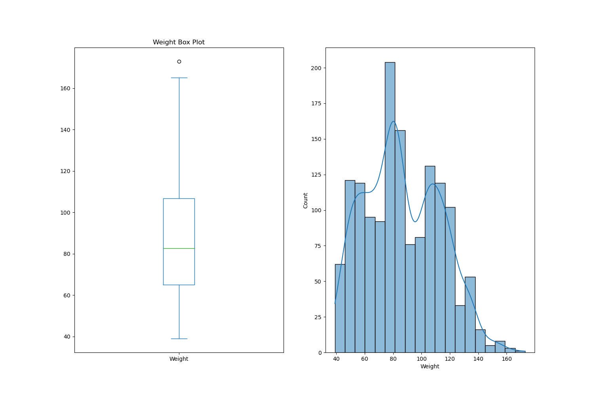

# BioMetrica

## Problem Definition 
The problem at hand is to develop a machine learning solution for "Body Level Classification" based on a given dataset. The dataset comprises various attributes related to the physical, genetic, and habitual conditions of individuals. These attributes consist of both categorical and continuous variables. The goal is to accurately classify the body level of a person into one of four distinct classes.

With a total of 1477 data samples, it is important to address the class imbalance issue in the dataset. The distribution of classes is uneven, meaning that certain classes may have significantly more or fewer instances than others. Therefore, it is necessary to build models that can effectively adapt to this class imbalance while aiming to achieve the best possible classification results.

## Data Visualization 
- Imbalanced target feature 
  
- Some features also exhibit imbalances, where the majority of their values tend to be skewed towards a single value.
    
    
- Furthermore, the presence of skewness can also be observed in certain data instances.
    
 

 

