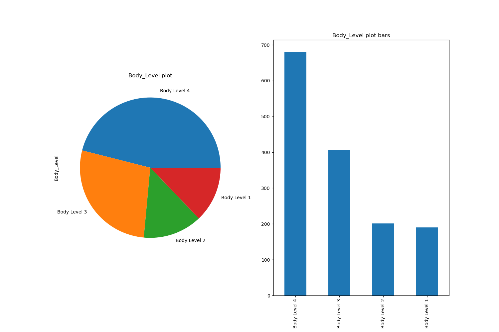
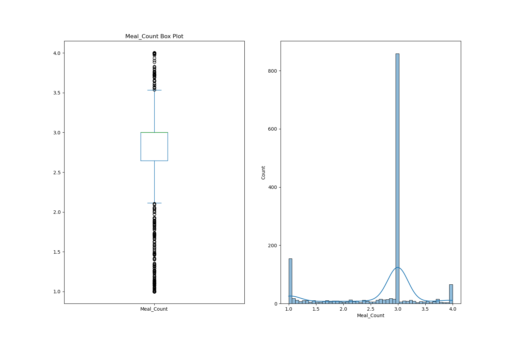
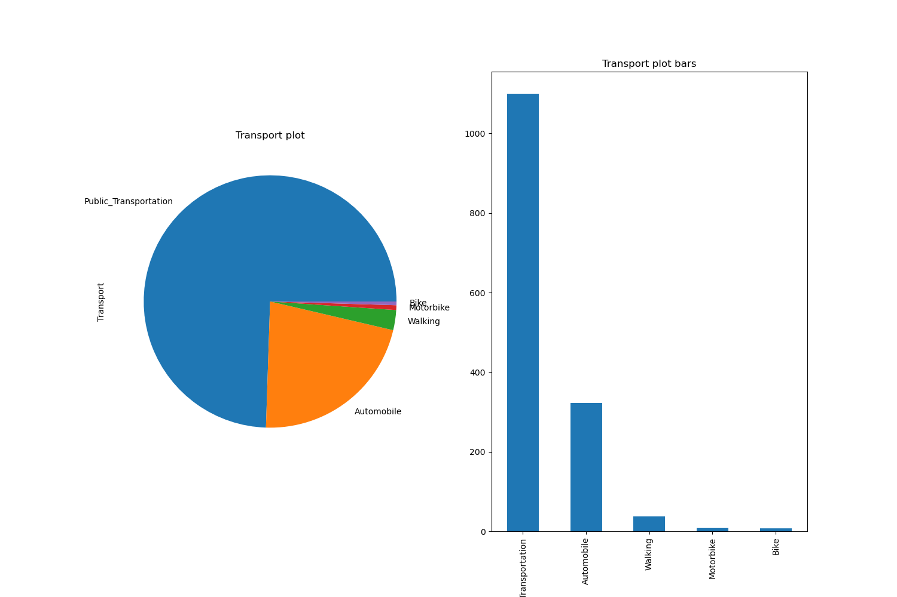
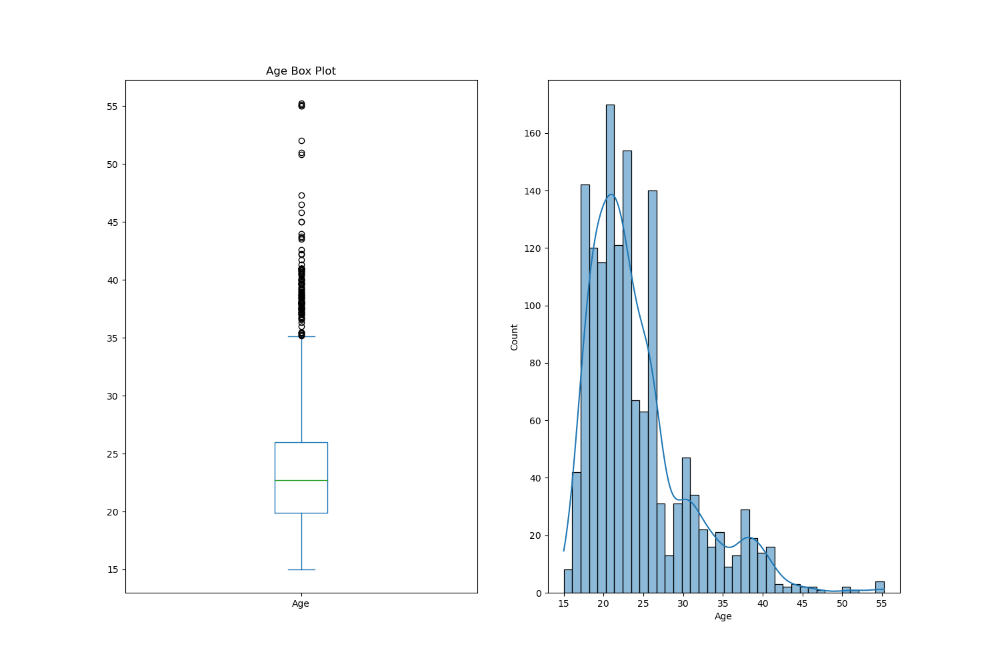
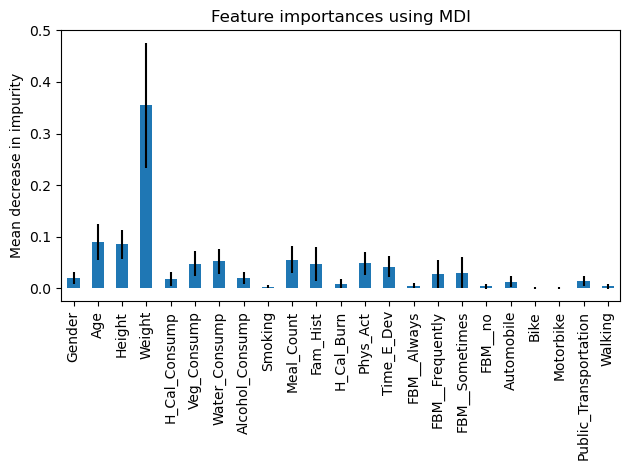

# BioMetrica

## Problem Definition 
The problem at hand is to develop a machine learning solution for "Body Level Classification" based on a given dataset. The dataset comprises various attributes related to the physical, genetic, and habitual conditions of individuals. These attributes consist of both categorical and continuous variables. The goal is to accurately classify the body level of a person into one of four distinct classes.

With a total of 1477 data samples, it is important to address the class imbalance issue in the dataset. The distribution of classes is uneven, meaning that certain classes may have significantly more or fewer instances than others. Therefore, it is necessary to build models that can effectively adapt to this class imbalance while aiming to achieve the best possible classification results.

## Data Visualization 
- **Imbalanced target feature** 
  
- **Some features also exhibit imbalances, where the majority of their values tend to be skewed towards a single value.**
     
    
     
    
- **Furthermore, the presence of skewness can also be observed in certain data instances.**
     
    
    
    
## Data preprocessing 

To prepare the data for analysis, the following preprocessing techniques will be applied:

- Standardization: The feature values will be standardized to have a mean of 0 and a standard deviation of 1, ensuring consistent scaling across different features.

- Log Transformation (for skewed data): When data exhibits skewness, a logarithmic transformation will be applied to reduce the impact of extreme values and achieve a more normal distribution.

- Oversampling (to tackle the imbalancing problem): To address the imbalance in certain features, oversampling techniques such as Synthetic Minority Over-sampling Technique (SMOTE) could be employed.**But we found that the regular random oversampling was a good choice** 

By implementing these preprocessing steps, we aim to improve the quality and suitability of the data for the subsequent stages of the project.

## Insights
**The feature importance analysis reveals that weight, age, and height of the person are the primary features that any model would prioritize in learning their significance. These features can be combined to calculate the Body Mass Index (BMI). However, it is important to note that BMI represents the true function in this problem. Therefore, including it as a feature in the model would be redundant or unnecessary. As a result, we do not require a machine learning model to solve this particular problem.**

## Models
- Logistic Regression
- Random forest regression
- SVM
- NN (Neural Network)

### Logistic Regression

 

